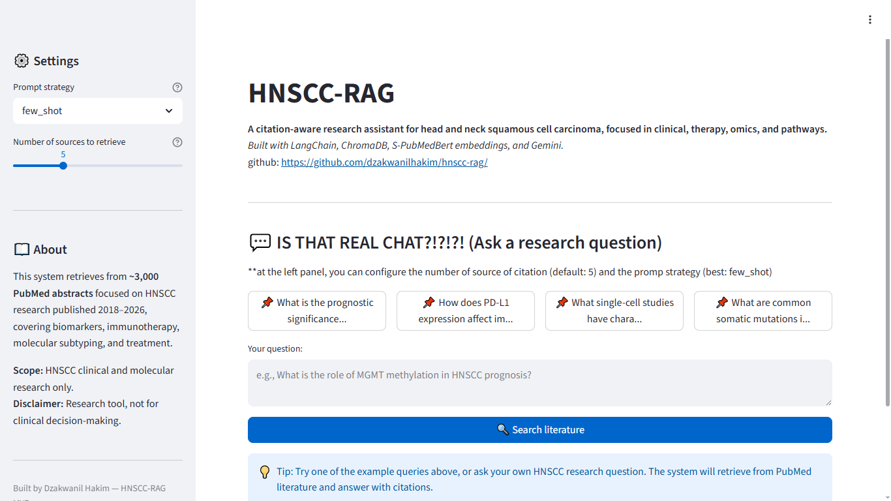
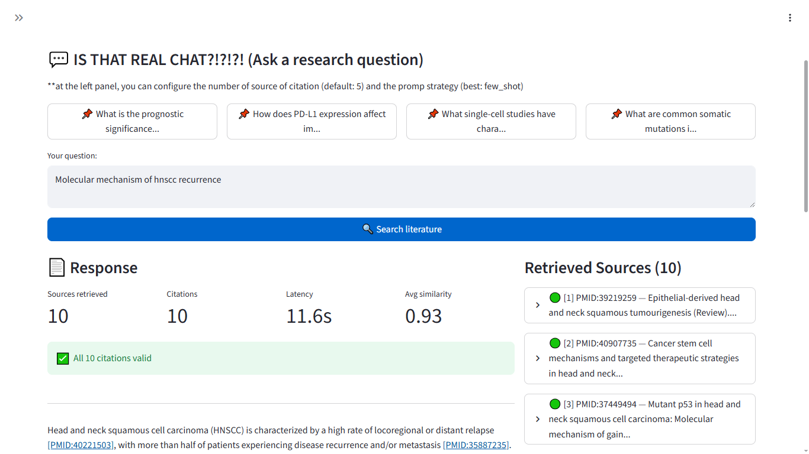
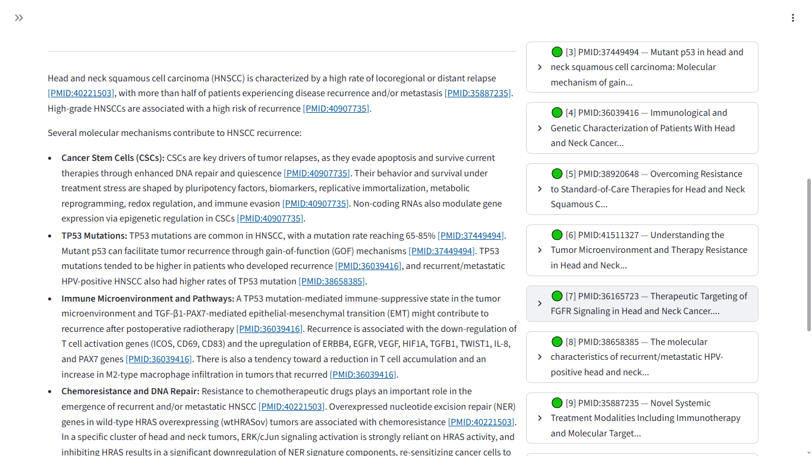
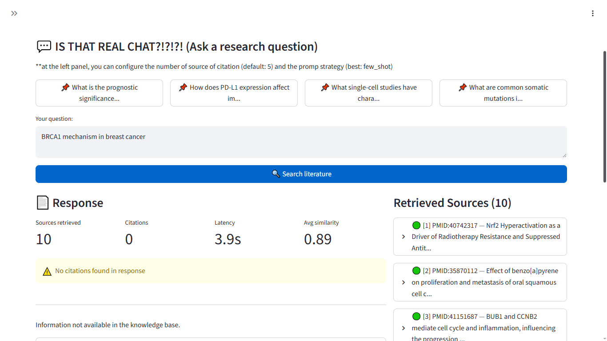

# HNSCC-RAG

A citation-aware retrieval-augmented generation system for head and neck squamous cell carcinoma (HNSCC) research, grounded in PubMed literature.

**Live demo:** [hnscc-rag.streamlit.app](https://hnscc-rag.streamlit.app)  
**Author:** Dzakwanil Hakim  
**Repository:** [github.com/dzakwanilhakim/hnscc-rag]  (https://github.com/dzakwanilhakim/hnscc-rag)

---

## What it does

HNSCC-RAG answers clinical and molecular research questions about head and neck squamous cell carcinoma by retrieving relevant PubMed abstracts and generating evidence-grounded responses with verified PMID citations. The system refuses to answer when the knowledge base lacks supporting evidence, addressing two core limitations of general-purpose LLMs in biomedical research: hallucination and lack of provenance.

---

## Screenshots

**Empty state — example queries and free-text input**



**Response with inline citations and retrieved sources panel**



**Chain-of-thought variant showing explicit reasoning before synthesis**



**Out-of-scope refusal — system correctly declines non-HNSCC queries**



---

## Stack

| Layer | Technology |
|-------|------------|
| Embedding model | pritamdeka/S-PubMedBert-MS-MARCO (768-dim, biomedical-specific) |
| Vector store | ChromaDB (persistent, cosine similarity) |
| LLM | Google Gemini 2.5 Flash |
| UI | Streamlit |
| Corpus | ~3,000 PubMed abstracts, HNSCC-focused, 2018-2026 |
| Deployment | Streamlit Community Cloud |

---

## How it works

1. User submits a research question via the web UI
2. The query is encoded with S-PubMedBert and matched against 3,000 HNSCC abstracts via cosine similarity in ChromaDB
3. Top-5 most relevant abstracts are retrieved and injected into a prompt template
4. Gemini generates a response with inline citations in the format `[PMID:xxxxxxxx]`
5. A regex-based citation validator verifies all cited PMIDs exist in the retrieved context
6. The response and retrieved sources are rendered in the UI with clickable PubMed links

The pipeline is exposed through a clean class-based API: `HNSCCRAGChain.run(query, variant, k)`.

---

## Corpus design

The knowledge base was constructed through three complementary PubMed queries managed via a YAML configuration file, covering:

- **Core** — clinical and translational research: biomarkers, prognosis, treatment, immunotherapy
- **Omics** — molecular profiling: transcriptomics, genomics, methylation, single-cell
- **Mechanistic** — molecular biology: signaling pathways, gene regulation, functional studies

Each abstract is tagged with which queries retrieved it, enabling source-aware retrieval analysis. The corpus was filtered for minimum abstract length, deduplicated by PMID, and capped to the most recent 3,000 abstracts after recency sorting.

**Topic coverage:**

| Topic | Coverage |
|-------|----------|
| Prognosis / Survival | 61% |
| Tumor microenvironment | 24% |
| Immunotherapy | 24% |
| HPV biology | 23% |
| Transcriptomics | 17% |
| Biomarkers | 17% |
| Single-cell | 10% |
| Mutations / Variants | 7% |
| Machine learning / AI | 3% |

The distribution reflects the actual landscape of recent HNSCC literature rather than artificially balanced sampling.

---

## Prompt engineering

Three prompt variants were implemented and systematically compared:

- **Zero-shot** — direct instruction with citation enforcement rules
- **Few-shot** — instructions plus two formatted example query-response pairs
- **Chain-of-thought** — explicit relevance analysis step before synthesis

All three enforce a strict citation rule: every factual claim must cite a PMID from the retrieved context, and the system must refuse with a specific phrase when the context does not support an answer.

---

## Evaluation

### Retrieval (Phase 3)

Evaluated on 20 manually constructed test queries spanning HPV, immunotherapy, biomarkers, mutations, single-cell, and other HNSCC subtopics.

| Metric | Result |
|--------|--------|
| Coverage at 5 | 100% (20/20 queries) |
| Average topic-keyword Recall at 5 | 0.910 |
| Average cosine similarity | 0.951 |

Note: the metric uses a topic-keyword proxy rather than expert-annotated ground truth. True Recall at K would require manual relevance judgments. This limitation is acknowledged in `experiments/retrieval_evaluation.md`.

### Generation (Phase 5)

25 test queries (20 in-scope HNSCC, 5 out-of-scope) run across 3 prompt variants — 75 total LLM calls.

| Metric | Zero-shot | Few-shot | Chain-of-Thought |
|--------|-----------|----------|------------------|
| Clean citation rate | 100% | 100% | 100% |
| Average valid PMID ratio | 1.000 | 1.000 | 1.000 |
| Out-of-scope refusal rate | 100% | 100% | 100% |
| Average latency (s) | 7.43 | 7.23 | 9.67 |
| Average response length (words) | 155 | 169 | 341 |
| Composite score | 0.926 | 0.928 | 0.903 |

Composite score weights: 40% citation accuracy, 30% OOS refusal rate, 20% valid PMID ratio, 10% speed.

**Selected production variant: few-shot** (composite score 0.928).

Full reports: `experiments/retrieval_evaluation.md` and `experiments/evaluation_report.md`.

### Notable edge case

The chain-of-thought variant on out-of-scope queries occasionally produced reasoning traces that mentioned PMIDs during the relevance analysis step. The regex-based citation validator counted these as valid citations even though the response correctly refused to answer the underlying question. This reveals a limitation of regex-based citation extraction: it cannot distinguish citations supporting claims from PMID references in reasoning traces. Documented in `experiments/evaluation_report.md`.

---

## Architecture

### Current implementation

```
[User query]
      |
      v
[S-PubMedBert embedding]
      |
      v
[ChromaDB cosine similarity search — top-5 abstracts]
      |
      v
[Prompt template injection — zero-shot / few-shot / chain-of-thought]
      |
      v
[Gemini 2.5 Flash API call]
      |
      v
[Citation validator — verify PMIDs against retrieved context]
      |
      v
[Structured RAGResponse — text + validation + diagnostics]
      |
      v
[Streamlit UI — response + source panel + clickable citations]
```

### Production migration path (AWS)

The system is designed for direct migration to cloud infrastructure with no changes to the core RAG logic:

```
[Browser] --> [CloudFront] --> [API Gateway] --> [Lambda: orchestration]
                                                        |
                              --------------------------+-------------------------
                              |                         |                        |
                    [OpenSearch Serverless]      [AWS Bedrock]           [S3: abstracts]
                    replaces ChromaDB            replaces Gemini         replaces local JSON
                              |
                    [SageMaker endpoint]
                    replaces local embedding
```

| Local component | AWS production equivalent |
|-----------------|--------------------------|
| ChromaDB | OpenSearch Serverless |
| Gemini API | AWS Bedrock (Claude or Gemini) |
| Embedding model (local) | SageMaker inference endpoint |
| Local JSON | S3 |
| Streamlit | Lambda + API Gateway + frontend |
| Logging | CloudWatch |

---

## Repository structure

```
hnscc-rag/
├── app/
│   ├── streamlit_app.py          # Main UI entry point
│   ├── components.py             # Reusable Streamlit components
│   └── __init__.py
├── src/
│   ├── config.py                 # Centralized configuration
│   ├── retriever.py              # HNSCCRetriever class
│   ├── rag_chain.py              # HNSCCRAGChain — full pipeline
│   ├── prompts.py                # Three prompt variant builders
│   ├── validators.py             # Citation validator
│   ├── oos_detector.py           # Out-of-scope refusal detector
│   └── __init__.py
├── scripts/
│   ├── 01_download_pubmed.py     # Corpus download
│   ├── 02_filter_abstracts.py    # Cleaning and deduplication
│   ├── 03_validate_corpus.py     # Corpus validation
│   ├── 04_check_scope.py         # Topic coverage analysis
│   ├── 06_validate_chroma.py     # ChromaDB validation
│   ├── 07_test_retriever.py      # Retriever smoke test
│   ├── 08_evaluate_retrieval.py  # Retrieval evaluation
│   ├── 09_test_rag.py            # Full pipeline smoke test
│   └── queries_hnscc.yaml        # PubMed query definitions
├── experiments/
│   ├── test_queries.json         # 25 evaluation queries
│   ├── run_eval.py               # Full evaluation runner
│   ├── analyze_eval.py           # Metric aggregation
│   ├── evaluation_report.md      # Generation evaluation report
│   ├── retrieval_evaluation.md   # Retrieval evaluation report
│   └── manual_review.md          # Manual spot-check findings
├── data/
│   ├── hnscc_abstracts.json      # Cleaned corpus (~3,000 abstracts)
│   └── chroma_db/                # Persistent ChromaDB vector store
├── docs/
│   └── screenshots/              # UI screenshots
├── requirements.txt
├── .env.example
├── .streamlit/
│   └── config.toml
└── README.md
```

---

## Local setup

### Prerequisites

- Python 3.11
- Conda (Miniconda recommended)
- Google AI Studio API key
- NCBI API key (free, from ncbi.nlm.nih.gov)

### Installation

```bash
git clone https://github.com/dzakwanilhakim/hnscc-rag.git
cd hnscc-rag

conda create -n hnscc-rag python=3.11 -y
conda activate hnscc-rag

pip install -r requirements.txt
```

### Configuration

```bash
cp .env.example .env
nano .env
```

Fill in:

```
GOOGLE_API_KEY=your-gemini-api-key
NCBI_API_KEY=your-ncbi-api-key
NCBI_EMAIL=your-email@example.com
LLM_MODEL=gemini-2.5-flash
```

### Run

```bash
streamlit run app/streamlit_app.py
```

App opens at `http://localhost:8501`. First load takes approximately 30 seconds (embedding model initialization).

### Reproduce corpus and embeddings

```bash
# Download abstracts from PubMed
python scripts/01_download_pubmed.py

# Filter and clean
python scripts/02_filter_abstracts.py

# Validate corpus
python scripts/03_validate_corpus.py
python scripts/04_check_scope.py
```

ChromaDB rebuild requires GPU (recommended: Colab T4 free tier). The pre-built index ships with the repository for immediate use.

### Run evaluation

```bash
# Retrieval evaluation
python -m scripts.08_evaluate_retrieval

# Full generation evaluation (75 LLM calls)
python -m experiments.run_eval
python -m experiments.analyze_eval
```

---

## Limitations

- Retrieval metric uses topic-keyword proxy, not expert-annotated ground truth
- Citation validator uses regex parsing and cannot distinguish claim citations from CoT reasoning traces
- Dense-only retrieval — no BM25 hybrid search or cross-encoder re-ranking
- No conversational memory across queries
- Corpus limited to approximately 3,000 abstracts for the MVP

---

## Disclaimer

Research tool only. Not intended for clinical decision-making, diagnosis, or treatment recommendations. Always consult qualified medical professionals for clinical questions.
